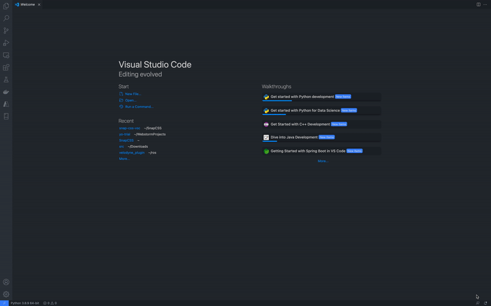

# Snap CSS - A CSS Optimizer

This is the Visual Studio Code extension for the CSS Optimization tool, SnapCSS.

## How to Use

Snap CSS loads an input CSS code and exports an optimized version of it.

## Requirements

If you have any requirements or dependencies, add a section describing those and how to install and configure them.
